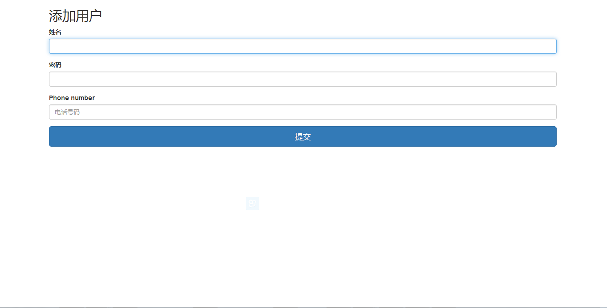

# springmvc-spring-hibernate-demo

<h3>实现</h3>

整合SpringMVC, Spring, Hibernate，具备增删改查功能。

数据库用的MySQL。

<h3>版本</h3>

MySQL 5.7.13

spring-framework 4.3.2.RELEASE

hibernate 5.2.2.Final

以及`pom.xml`文件里面的其他各个依赖包

<h3>欢迎界面</h3>

<h3>添加用户界面</h3>

